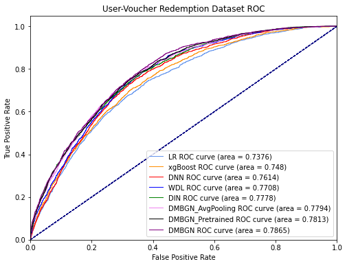

# DMBGN: Deep Multi-Behaviors Graph Network for Voucher Redemption Rate Prediction
The implementation of the submitted paper "Deep Multi-Behaviors Graph Network for Voucher Redemption Rate Prediction" in [SIGKDD 2021](https://www.kdd.org/kdd2021/) Applied Data Science Track. 

DMBGN utilizes a User-Behavior Voucher Graph (UVG) to extract complex user-voucher-item relationship and the attention mechanism to capture users' long-term voucher redemption preference. Experiments shows that DMBGN achieves 10%-16% relative AUC improvement over Deep Neural Networks (DNN), and 2% to 4% AUC improvement over Deep Interest Network (DIN).

Benchmark Dataset
-------
A randomly desensitized sampled dataset from one of the large-scaled production dataset from from Lazada (Alibaba Group) is included. The dataset contains three dataframes corresponding users' voucher collection logs, related user behavior logs and related item features, a detailed description can be found in ./data/README.md file.

We hope this dataset could help to facilitate research in the voucher redemption rate prediction field.

DMBGN Performance
-------
Compared Models: 

- LR: Logistic Regression [1], a shallow model. 
- GBDT: Gradient Boosting Decision Tree [2], a tree-based non deep-learning model.
- DNN: Deep Neural Networks.
- WDL: Wide and Deep model [3], a widely accepted model in real industrial applications with an additional linear model besides the deep model compared to DNN.
- DIN: Deep Interest Network [4], an attention-based model in recommendation systems that has been proven successful in Alibaba.
 

The experimental results on the public sample dataset are as follows: 

|      Model       |  AUC   | RelaImpr(DNN) | RelaImpr(DIN) | Logloss |
| ---------------- | ------ | ------------- | ------------- | ------- |
|       LR         | 0.7377 |     -9.07%    |    -14.52%    |  0.3897 |
|       GBDT       | 0.7480 |     -5.10%    |    -10.78%    |  0.3841 |
|       DNN        | 0.7614 |     0.00%     |     -5.99%    |  0.3783 |
|       WDL        | 0.7708 |     3.63%     |     -2.58%    |  0.3719 |
|       DIN        | 0.7780 |     6.37%     |     0.00%     |  0.3679 |
| DMBGN-AvgPooling | 0.7794 |     6.89%     |     0.49%     |  0.3697 |
| DMBGN-Pretrained | 0.7813 |     7.62%     |     1.17%     |  0.3663 |
|      DMBGN       | 0.7865 |     9.63%     |     3.06%     |  0.3620 |

Note that this dataset is a random sample from dataset Region-C and the performance is different as in the submitted paper due to the smaller sample size. However, the conclusion from the experiment results is consistent with the submitted paper, where DMBGN achieves 9.6% relative AUC improvement over DNN and 3.1% uplift over DIN. 

How To Use
-------
All experiment codes are organized into the DMBGN_SIGKDD21-release.ipynb jupyter notebook including corresponding running logs, detail code implementation of each model (LR, GBDT, DNN, WDL, DIN, DMBGN) can be found in ./models folder. 

To run the experiments, simply start a [jupyter notebook](https://jupyter.org/) and run all code cells in the DMBGN_SIGKDD21-release.ipynb file and check the output logs. Alternatively, you can refer to the existing log outputs in the notebook file.

To use the DMBGN model, please refer to the code implementation in ./models/DMBGN.py.

### Requirement
python: 3.7.1  
numpy: 1.19.5  
pandas 1.2.1  
pandasql 0.7.3  
torch: 1.7.1  
torch_geometric: 1.6.3  
torch: 1.7.1  
torch-cluster: 1.5.8  
torch-geometric: 1.6.3  
torch-scatter: 2.0.5  
torch-sparse: 0.6.8  
torch-spline-conv: 1.2.0  
torchaudio: 0.7.2  
torchvision: 0.8.2  
deepctr-torch: 0.2.3  
pickle: 4.0

What To Do
-------
- We are currently deploying DMBGN model online for Lazada voucher related business, the online A/B testing performance will be reported soon.
- More detailed code comments are being added.

Acknowledgment
-------
Out code implementation is developed based on the [Deep Interest Network (DIN)](https://deepctr-doc.readthedocs.io/en/latest/_modules/deepctr/models/din.html) codes from the DeepCTR package, with modification to fit DMBGN model architecture and multi-GPU usage.

Reference
-------
- [1] H Brendan McMahan, Gary Holt, David Sculley, Michael Young, Dietmar Ebner,Julian Grady, Lan Nie, Todd Phillips, Eugene Davydov, Daniel Golovin, et al.2013.  Ad click prediction: a view from the trenches. InProceedings of the 19thACM SIGKDD international conference on Knowledge discovery and data mining.1222–1230.
- [2] Guolin Ke, Qi Meng, Thomas Finley, Taifeng Wang, Wei Chen, Weidong Ma,Qiwei Ye, and Tie-Yan Liu. 2017. Lightgbm: A highly efficient gradient boostingdecision tree.Advances in neural information processing systems30 (2017), 3146–3154.
- [3] Heng-Tze Cheng, Levent Koc, Jeremiah Harmsen, Tal Shaked, Tushar Chandra,Hrishi Aradhye, Glen Anderson, Greg Corrado, Wei Chai, Mustafa Ispir, RohanAnil, Zakaria Haque, Lichan Hong, Vihan Jain, Xiaobing Liu, and Hemal Shah.2016. Wide & Deep Learning for Recommender Systems.CoRRabs/1606.07792(2016). arXiv:1606.07792  http://arxiv.org/abs/1606.07792 .
- [4] Guorui Zhou, Xiaoqiang Zhu, Chenru Song, Ying Fan, Han Zhu, Xiao Ma, YanghuiYan, Junqi Jin, Han Li, and Kun Gai. 2018. Deep interest network for click-throughrate prediction. InProceedings of the 24th ACM SIGKDD International Conferenceon Knowledge Discovery & Data Mining. 1059–1068.